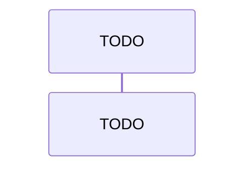

## Purpose

This skill is the operating manual the `project-overview` runtime agent reloads at the start of every run. It is the auditable source for narrative-tree generation under `docs/narrative/` — BC detection cited by reference to `project-explorer`, narrative file content contracts (`architecture.md` + `walkthrough.md`), Mermaid sourcing rules, frontmatter contract, human-edit fence convention, auto-write contract, idempotency guard. The agent treats this file as authoritative for the run; the co-located `research.md` carries the long-form citations and per-category enumerations that this file cites by reference. This file is also reloaded by `.claude-user/agents/project-wiki-enhancer.md` when it runs the narrative pass of `/project:enhance-wiki` (see `## Diff-aware update mode` below); the bootstrap `project-overview` agent uses sections above `## Diff-aware update mode`, the enhancer agent uses sections at or below it.

## Inputs

- `<path>` (required) — local filesystem path to the target repository. No remote URLs; no cloning; no git invocation. The agent reads the path read-only.
- `[branch-name]` (optional) — recording-only string. Written to the `branch_name` field in each generated file's frontmatter. The user is responsible for actually checking out the branch they want recorded before invoking the command — the agent does not switch branches.

## Idempotency guard

Before reloading this skill (operating procedure step 2), the agent checks `docs/narrative/` of the **current working directory** (not `<path>`).

**Refuse condition.** `docs/narrative/` exists AND contains at least one non-hidden file when searched recursively. "Hidden" means the filename starts with `.` — the POSIX convention; the Windows filesystem hidden attribute is not consulted. Examples of hidden files that do NOT trigger refusal: `.git`, `.DS_Store`, `.gitkeep`.

**Proceed condition.** `docs/narrative/` is missing, OR `docs/narrative/` exists but contains no non-hidden files (recursive). Empty subtrees alone do not trigger refusal — only at least one non-hidden file (recursive) triggers.

**Refusal message.** When the refuse condition is met, the agent prints the literal message:

```
docs/narrative/ is not empty. project-overview is a one-shot bootstrapper. Re-run after manually clearing docs/narrative/ if you need to regenerate.
```

and exits before the skill-load step (step 2 of `## Operating procedure`) continues. No repo walk, no candidate surfacing, no writes.

## Operating procedure

Numbered steps 1-7. The agent must execute these in order; later sections in this skill fill in the precise contract for each step.

1. **Idempotency guard.** Resolve `<path>`; check the current working directory's `docs/narrative/`. If it exists and is non-empty, refuse with the canonical message and exit before any further step runs. See `## Idempotency guard` above.
2. **Skill load.** The agent reloads this `SKILL.md` and treats it as the operating manual for the rest of the run. The agent must not proceed past this step if the skill file is missing or malformed.
3. **Repo walk.** The agent scans `<path>` for exposed endpoints, handlers, workers, and domain code signals via the reuse-by-reference rule in `## BC candidate surfacing (cite project-explorer)` below. Excludes test projects, generated files, `bin/`, `obj/`, `node_modules/`, `dist/` per the same exclusion globs as `project-explorer`.
4. **BC candidate surfacing.** The agent groups signals into bounded-context candidates per `## BC candidate surfacing (cite project-explorer)` below — same grouping rule as the sibling skill.
5. **Print candidate report (non-blocking).** The agent prints the candidate report for the audit trail per `## Auto-write` below, then proceeds directly to output generation. No human approval is required; the agent does not halt.
6. **Output generation.** After printing the candidate report, the agent writes `docs/narrative/architecture.md` and `docs/narrative/<bc>/walkthrough.md` per `## Output schema` below.
7. **Frontmatter recording.** Every file the agent emits under `docs/narrative/` carries the five-field YAML frontmatter block per `## Frontmatter contract` below.

## BC candidate surfacing (cite project-explorer)

This section is the full contract for steps 4 and 5 of the `## Operating procedure`. The contract is **reused by reference, not by copy** from the sibling skill — the runtime agent loads the sibling's authoritative content at runtime.

- **Grouping rule reuse.** BC grouping rules are reused verbatim from `.claude-user/skills/project-explorer/SKILL.md` `## BC candidate surfacing` `### Grouping rule`. Reference by section name; the text is not duplicated here. The rule: BC candidates MUST be derived from observable repo namespacing, top-level project boundaries, or folder structure observed during step 3 (repo walk); each candidate name MUST trace to a real namespace token or folder path; names that do not trace to source MUST be rejected before the candidate report is printed.

- **Candidate report format reuse.** The candidate report format is reused verbatim from `.claude-user/skills/project-explorer/SKILL.md` `## BC candidate surfacing` `### Candidate report format` — same numbered `### BC candidates` list with per-candidate nested bullets (`Rationale` naming the contributing folders / namespaces, `Aggregates detected` listing the aggregate root with `file:line` citation as an inline-code span), same `### Conflicts detected` H3 subsection (rendered as `(none)` when empty).

- **Small-repo fallback detection reuse.** Small-repo fallback detection rules are reused verbatim from `.claude-user/skills/project-explorer/SKILL.md` `## BC candidate surfacing` `### Small-repo fallback detection`. The same three independent triggers apply (total first-class source files < 20; only one top-level namespace or project; BC candidate count <= 1). When the fallback fires, the agent emits a single-folder narrative tree at `docs/narrative/module-map/walkthrough.md` (mirroring `module-map` as a fallback-mode token, exempt from the trace-to-source rule, same as the sibling skill).

The reuse is by reference, not by copy. Any edit to grouping rules, candidate report format, or fallback detection in `.claude-user/skills/project-explorer/SKILL.md` is automatically inherited by this skill on next reload.

## Output schema

The agent emits a human-readable narrative tree under `docs/narrative/` of the working directory. The three subsections below define exactly which files are written, what content each file carries, and the always-emit `## Stubs` summary contract per `analyze-workflow-project-explore.analyzed.md` § 7 row 5. Frontmatter contract for every emitted file is defined in `## Frontmatter contract`; every file under `docs/narrative/` carries the five-field YAML block as its first content.

### Files written

```
docs/
  narrative/                                # OUTPUT TARGET (written at runtime, not at scaffold-author time)
    architecture.md
    <bounded-context>/
      walkthrough.md
```

### Per-file content contract

All `file:line` citations in the output tree use paths relative to the `<path>` root the agent was invoked against. Empty sections are rendered as `(none)` rather than omitted, preserving the locked file shape consumed by the narrative diff-aware updater documented in `## Diff-aware update mode` below.

| File | Required content |
|---|---|
| `architecture.md` | One-pager narrative overview. Section list in order: `## Overview` (3-paragraph plain-words intro to the repo and its business purpose), `## File structure` (annotated tree of the top-level repo layout — directories + one-line descriptions), `## Dependencies` (bulleted list of top-level external dependencies — frameworks, runtimes, datastores — derived from `*.csproj` / `package.json` / `pom.xml` / equivalent), `## Exposed endpoints` (table of detected HTTP / gRPC / message-queue entry points with `file:line` citation column), `## Workers` (table of detected background workers / hosted services / scheduled jobs with `file:line` citation column), `## Logic overview` (one paragraph per detected BC summarising its responsibility in plain words), `## Skipped candidates` (removed-BC log target per `## Removed-BC logging (narrative)` below; body renders as `(none)` when bootstrap detected no skips). `(none)` for empty sections. All `file:line` citations relative to `<path>`. |
| `<bounded-context>/walkthrough.md` | Per-BC narrative walkthrough. Section list in order: `## Sequence diagram` (exactly one Mermaid sequence diagram of the BC's main flow — see `## Mermaid sourcing rules` for derived-vs-stub policy), `## Intro` (3-paragraph plain-words intro to what this BC does, who its actors are, and what its key invariants are), one `## Drill-down: <name>` section per detected endpoint / handler / worker inside the BC (each contains a 1-2 paragraph technical explanation with `file:line` citations as inline-code spans). `(none)` for empty sections. Single file per BC — no fan-out. |

### Stubs summary contract

Every `walkthrough.md` file carries a `## Stubs` H2 section near the top of the file (immediately after the frontmatter and before the first content section) summarising every `TODO: ` stub block elsewhere in the file. The section renders as `(none)` when no stubs were emitted. See `## Mermaid sourcing rules` below for the per-stub format. The `## Stubs` section is **always emitted on every `walkthrough.md`** — its body is `(none)` when no stubs were emitted, but the heading is always present. The `## Stubs` section is **not emitted in `architecture.md`** (no Mermaid blocks appear there). This is the contract called out in `analyze-workflow-project-explore.analyzed.md` § 7 row 5.

## Frontmatter contract

Every file the agent emits under `docs/narrative/` carries a five-field YAML frontmatter block as its **first content**, before any heading. The contract:

- **`source_repo`** — the `<path>` argument resolved to an absolute path, normalized to POSIX-style forward slashes (the agent normalizes Windows backslashes to forward slashes). Trailing slashes are stripped. UNC paths and symlinks are passed through as the OS resolves them; this contract does not enforce a specific transformation beyond slash normalization.
- **`branch_name`** — the `[branch-name]` argument as a YAML scalar when supplied (e.g., `branch_name: main`). When the argument is omitted, the value is the bare YAML `null` token (which parses as the YAML null value), NOT the quoted string `"null"`.
- **`generated_at`** — ISO-8601 UTC timestamp with second precision and the literal `Z` suffix, e.g., `2026-05-18T10:30:00Z`. Sub-second precision is not used. The timezone is always UTC.
- **`skill_version`** — integer matching the `version` field of this `SKILL.md`'s YAML frontmatter (currently `1`). If a future revision of this skill bumps the `version` field, the writer stamps the new integer; the contract has no auto-track magic.
- **`last_generated_sha`** — added for parity with the field `project-wiki-enhancer` introduces on `docs/domain/`. v1 emits this field on every file under `docs/narrative/` when `<path>` is a git working tree, stamped to current HEAD SHA at the time of the run. When `<path>` is not a git working tree, the field is **omitted entirely** from the frontmatter block (same tolerate-missing convention as `project-wiki-enhancer`'s no-git path — see `.claude-user/skills/project-wiki-enhancer/SKILL.md` `## Hybrid diff strategy` `### last_generated_sha tolerate-missing`).

Example frontmatter block emitted at the top of every file under `docs/narrative/` (git working tree case):

```yaml
---
source_repo: C:/repos/eShopOnContainers
branch_name: main
generated_at: 2026-05-18T10:30:00Z
skill_version: 1
last_generated_sha: 4f3a2b1c9d8e7f6a5b4c3d2e1f0a9b8c7d6e5f4a
---
```

The frontmatter block is the **first content** in every file under `docs/narrative/`, before any heading or paragraph. If a heading appears before the frontmatter block, the file is malformed.

## Human-edit fences

Every file the agent emits under `docs/narrative/` carries `<!-- human:begin -->` and `<!-- human:end -->` fence markers around editable zones, exactly mirroring `docs/domain/`'s convention.

**Canonical fence placement.**

- In `walkthrough.md`: one fence pair immediately after each `## Intro` H2 heading. The fenced zone is the space where a human reader records additional plain-language context, corrections, or domain-expert commentary that should survive future regenerations.
- In `architecture.md`: one fence pair immediately after the `## Overview` H2 heading. The fenced zone is the space where a human reader records repo-level commentary (e.g., business context, historical decisions) that should survive future regenerations.

The narrative-side diff-aware updater is now active and preserves the fenced content byte-for-byte per `## Fenced human-edit zone splice (narrative)` below, which cite-by-references `.claude-user/skills/project-wiki-enhancer/SKILL.md` `### Fenced human-edit zone splice`. The fences are no longer inert.

**Migration shift on the narrative side (identical contract to the domain side).** With the narrative per-BC pre-check (`## Per-BC SHA pre-check (narrative)` below) in place, regen never fires for a BC whose narrative source slice is unchanged — so an outside-fence human edit in a `walkthrough.md` or `architecture.md` now **survives until that BC's narrative source slice changes**, at which point regen fires and overwrites it exactly as before. Fences (`<!-- human:begin --> ... <!-- human:end -->`) remain the **only** way to make an edit durable **across a source change** on the narrative side too — an outside-fence edit gains a reprieve only while the BC's narrative slice is unchanged, not durability in general. This is the **identical contract** to the domain side; see `.claude-user/skills/project-wiki-enhancer/SKILL.md` `## Migration caveat` for the canonical statement, and `analyzed.md` D5 for the contract choice.

## Diff-aware update mode

This section and every section below cite-by-reference contracts from `.claude-user/skills/project-wiki-enhancer/SKILL.md` and are loaded by the `project-wiki-enhancer` agent when the narrative pass runs. The bootstrap `project-overview` agent ignores everything under this heading; the bootstrap agent's contract is fully described in `## Operating procedure` above and finishes at `## Stop conditions`.

## Hybrid diff strategy (narrative)

See `.claude-user/skills/project-wiki-enhancer/SKILL.md` `## Hybrid diff strategy` for the full contract (git fast path / full-walk fallback / reason-token short-circuit / first-failure-wins ordering / `last_generated_sha` tolerate-missing). The narrative pass samples ONE file under `docs/narrative/` for `last_generated_sha`; the sampled file is `architecture.md` or any `<bc>/walkthrough.md` (NOT `<bc>/glossary.md`, which exists only under `docs/domain/`).

The narrative pass surfaces the same `Diff strategy:` audit lines verbatim as the enhancer prints them for the domain pass — one line per run depending on which path fires:

```
Diff strategy: git fast path (<last_generated_sha>..HEAD)
```

```
Diff strategy: full-walk fallback (reason: <missing-git | missing-sha | unreachable-sha>)
```

## Path -> BC classifier (narrative)

See `.claude-user/skills/project-wiki-enhancer/SKILL.md` `## Path -> BC classifier` (including `### Exclusion globs (verbatim)`, `### Namespace -> BC mapping`, `### Classification buckets`, and the per-bucket count-summary audit line). The narrative pass reuses the same three buckets (`BC-affecting` / `infra — no BC impact` / `new-namespace`) and the same eight exclusion globs without modification.

## Per-BC SHA pre-check (narrative)

See `.claude-user/skills/project-wiki-enhancer/SKILL.md` `## Per-BC SHA pre-check` for the full per-BC pre-check contract (per-BC source-path resolution via the reverse mapping, per-BC SHA gather, conservative any-missing/any-unreachable/unresolvable -> no-skip gates, oldest-wins `min(reachable)` base, empty->SKIP / non-empty->fall-through). The narrative pass uses the **identical algorithm** — same gates, same oldest-wins base; only the inputs differ, not the logic. It does **not** fork or restate the gate logic, the SHA-gather loop, the reachability test, or the diff command — the enhancer section owns those literals and the narrative pass borrows them by reference.

**Narrative-side source slice.** The narrative pass resolves the **narrative** source slice for a BC — the endpoints / handlers / workers its `walkthrough.md` drills into — which is **distinct** from the domain slice (the aggregates / events / commands / repositories / services its schema rows cite). Same algorithm, different inputs. The narrative pass gathers per-file `last_generated_sha` from the BC's narrative output under `docs/narrative/<bc>/` (the narrative tree's **own** frontmatter), **not** from `docs/domain/<bc>/`. `architecture.md` is the repo-wide narrative roll-up and is **out of per-BC scope**, mirroring how `context-map.md` / `glossary.md` are roll-ups on the domain side (per D6). For which narrative files carry `last_generated_sha` and how the narrative pass samples them, see `## Hybrid diff strategy (narrative)` above (the sampled file is `architecture.md` or any `<bc>/walkthrough.md`) — that fact is not redefined here.

**Per-pass independence (the D4 assertion).** The narrative pass and the domain pass each own their **own** pre-check decision — independent decisions, not coupled. In a **single run** the narrative pass MAY **SKIP** a BC while the domain pass **REGENERATES** the same BC, **or vice versa** (the domain pass SKIPs a BC the narrative pass regenerates). This divergence is **expected and correct, NOT a bug**, and MUST NOT be "fixed" by coupling the two decisions — coupling would force regen of a tree whose own slice is unchanged, re-introducing the exact waste this feature removes. The two trees carry **independent** `last_generated_sha` values and **independent** source slices, which is the structural reason the decisions diverge. See `analyzed.md` D4.

**Reuse the skip line with `pass=narrative`.** The narrative SKIP reuses the **same** skip-line literal defined in `.claude-user/skills/project-wiki-enhancer/SKILL.md` `### Skip log line (verbose/debug only)` (cited by exact heading name); it does **not** redefine the parameterized literal. The narrative-side application emits the concrete instance:

```
SKIP bc=<name> pass=narrative (sha unchanged)
```

The **same** verbose/debug-only emission condition applies: the line is emitted only under verbose/debug mode, once per SKIPPED BC; a **normal** narrative-pass run stays **silent** for a skipped BC. The locked `No changes detected. 0 files written.` cross-pass exit is **unchanged** — per `## Idempotency exit (narrative)` it fires **once per run** across both passes, so the narrative SKIP introduces no new normal-run line.

## Fenced human-edit zone splice (narrative)

See `.claude-user/skills/project-wiki-enhancer/SKILL.md` `### Fenced human-edit zone splice` for the per-file algorithm, never-touch invariant, and anchor-drift limitation. The narrative pass uses the identical algorithm. Per D8, the narrative fences have two canonical placements per `## Human-edit fences` above (one fence pair after each `## Intro` H2 in `walkthrough.md`; one fence pair after the `## Overview` H2 in `architecture.md`); both placements survive the splice unchanged because the algorithm is anchor-position based, not section-name based.

## Removed-BC logging (narrative)

The narrative-side equivalent of `.claude-user/skills/project-wiki-enhancer/SKILL.md` `## Removed-BC logging`. For each existing `<bc>/` folder under `docs/narrative/` whose namespace is no longer present in source, the enhancer appends one bullet to the log target described below. **Never delete** the `<bc>/walkthrough.md` file. **Never delete** the `<bc>/` folder. **Never touch** any file inside a removed-BC folder beyond the single `architecture.md` append.

- **Log target.** The append target is the `## Skipped candidates` H2 section in `docs/narrative/architecture.md`. The bootstrap writer (operating procedure step 6) MUST also emit this `## Skipped candidates` section as part of the per-file content contract for `architecture.md`, rendering the body as `(none)` when bootstrap detected no skips — same convention as the domain side's `context-map.md`.
- **Bullet format.** Identical to the domain side. The bullet template is exactly `- <bc-name>: namespace no longer present` (single locked reason token per `.claude-user/skills/project-wiki-enhancer/SKILL.md` `### Reason token (locked)`).
- **Folder-name vs namespace-token disambiguation.** The `<bc-name>` is the on-disk folder name under `docs/narrative/<bc>/`, NOT the source namespace token. Case preserved verbatim from the filesystem. The folder name is the user-visible identifier the human reader recognises from their `docs/narrative/` tree; the source namespace token may already have disappeared by the time this code runs.
- **Idempotency of the log.** Before appending, the enhancer reads the body of the `## Skipped candidates` section and checks for an existing matching line. The duplicate check is **exact-line match** (the full literal line including the leading `- ` bullet prefix), **case-sensitive**, scoped between the `## Skipped candidates` H2 and the next H2 (or EOF). Verbatim per `.claude-user/skills/project-wiki-enhancer/SKILL.md` `### Idempotency of the log`. Note: in `docs/narrative/architecture.md`, `## Skipped candidates` IS the final H2 (it is inserted after `## Logic overview` per `### Per-file content contract` above), so the EOF clause of the scope rule is the one that fires for this file in practice.
- **`(none)` placeholder handling.** If the body of `## Skipped candidates` is the literal single line `(none)` (the bootstrap placeholder when no skips were detected), the enhancer replaces that line **in place** with the first bullet on first append. Identical replacement-in-place rule per `.claude-user/skills/project-wiki-enhancer/SKILL.md` `` ### `(none)` placeholder handling ``.
- **Strict no-delete contract.** Never delete `<bc>/walkthrough.md`. Never delete the `<bc>/` folder. Never rewrite any file inside a removed-BC folder beyond the single `architecture.md` append. The folder is frozen until the human author decides to remove it manually.
- **Tolerate-missing on first run.** If `## Skipped candidates` is absent from a pre-feature `docs/narrative/architecture.md` (bootstrapped before this feature shipped), the updater emits the section with the first bullet (or with `(none)` if no removed BCs were detected this run). Cross-reference accepted risk row 4 in `analyzed.md` Section 9.

## Byte-compare + selective write + frontmatter refresh (narrative)

See `.claude-user/skills/project-wiki-enhancer/SKILL.md` `### Byte-compare` (UTF-8 byte-exact comparison; no normalization; skip-write decision) and `### Selective write + frontmatter refresh` (4-numbered-step refresh order; preserved `source_repo`; refreshed `branch_name`; refreshed `generated_at`; refreshed `skill_version`; `last_generated_sha` per the per-file git-path rule). The narrative pass writes only files whose post-fence-splice bytes differ from the on-disk bytes, exactly as the domain pass does. Frontmatter refresh stamps `skill_version` from this `project-overview/SKILL.md`'s `version` field (NOT the enhancer's), because output-schema versioning belongs to the schema owner — same rule the enhancer applies for the domain pass against the `project-explorer` skill version.

## Idempotency exit (narrative)

See `.claude-user/skills/project-wiki-enhancer/SKILL.md` `## Idempotency exit` for the zero-write exit message literal (`No changes detected. 0 files written.`), the non-zero-write summary format, and the no-partial-exit rule. **Cross-pass aggregation rule (load-bearing):** the canonical zero-write exit message is emitted **once per run**, NOT once per pass. It fires only when both passes (narrative + domain) together wrote zero files. On any non-zero-write run, the summary line aggregates counts across both passes — every write the narrative pass made plus every write the domain pass made contributes to the single run-summary line.

## Known coupling

- **Doctor-coupling marker (D6).** Once `/project:doctor` ships, `/project:enhance-wiki` will invoke `/project:doctor` as a default last step on mismatch / conflict / out-of-date signals. No code, no detection logic in v1 — this bullet records the contract so the future doctor implementer knows the enhancer is meant to be its caller.
- **Soft-input cite-back (D7).** `.claude-user/skills/project-explorer/SKILL.md` already documents the soft-input read of `docs/narrative/<bc>/walkthrough.md`. That soft-input contract is now fully active (it was inert when narrative was bootstrap-only and the diff path didn't exist; with the narrative diff-aware updater in this skill, the soft input is always available across runs).

## Mermaid sourcing rules

**Derived-where-reliable rule.** A Mermaid sequence diagram MAY be derived from code only when every node in the sequence cites a real `file:line` location in `<path>`. Nodes without a traceable `file:line` MUST NOT appear in a derived diagram.

**Stub-otherwise rule.** When the agent cannot reliably derive every node, it emits a `TODO: ` stub block instead. The stub format is a Mermaid code fence whose first line inside the fence is the literal `sequenceDiagram` keyword (required so Mermaid renderers parse the block), followed by the literal comment `%% TODO: derive this sequence — agent could not trace <N> step(s) to file:line` (where `<N>` is the count of underivable steps), followed by a single placeholder participant line. Example block:

````

````

**No-hallucination guard.** The agent MUST NOT invent participant names, message arrows, or `file:line` citations. This stance mirrors `.claude-user/skills/project-explorer/SKILL.md` `### Hallucination guard` for narrative output.

**Top-of-file `## Stubs` summary requirement.** Every `walkthrough.md` file MUST carry a `## Stubs` H2 section immediately after the frontmatter and before the first content section. The section lists every stub in the file as a bulleted line `- <section name>: <reason>` (e.g., `- Drill-down: PlaceOrderEndpoint: could not trace 4 step(s) to file:line`). Files with zero stubs render `## Stubs` with body `(none)` — the section is **always present** on every `walkthrough.md`, even when empty. The `## Stubs` section is **not emitted in `architecture.md`** (no Mermaid blocks appear there). This is the operator-visible flag referenced in `analyze-workflow-project-explore.analyzed.md` § 7 row 5.

## Auto-write

This contract is reused by reference from `.claude-user/skills/project-explorer/SKILL.md` `### Auto-write contract` — the narrative agent applies the identical posture to `docs/narrative/`. The cite-by-reference keeps the contract in a single place; any future edit to the sibling skill's auto-write contract is inherited here on next reload.

The agent is **fully agent-driven**: after printing the candidate report (`## BC candidate surfacing (cite project-explorer)`), the agent proceeds directly to writing `docs/narrative/`. There is **no APPROVE gate, no halt, and no edit-revision loop** — the agent surfaces its BC decisions in the printed report for the audit trail, then writes immediately. The only thing that stops a run is the `## Idempotency guard` (refuses when `docs/narrative/` is already non-empty); that guard is a re-run safety check, not an approval gate.

## Stop conditions

- **(a) Idempotency guard refuses.** `docs/narrative/` already exists and is non-empty in the working directory. The agent exits before any further step per `## Idempotency guard`.
- **(b) Skill file missing or malformed.** `.claude-user/skills/project-overview/SKILL.md` cannot be read, its YAML frontmatter does not parse, or required body sections (`## Operating procedure`, `## BC candidate surfacing (cite project-explorer)`, `## Output schema`, `## Frontmatter contract`, `## Auto-write`) are absent. The agent stops before step 3 of `## Operating procedure`.
- **(c) Sibling skill missing or malformed.** `.claude-user/skills/project-explorer/SKILL.md` cannot be read or its required sections (`### Grouping rule`, `### Candidate report format`, `### Small-repo fallback detection`, `### Auto-write contract`) are absent. The agent stops before step 3 of `## Operating procedure` — BC surfacing cannot proceed without the sibling's grouping rule. (Without this guard, the cite-by-reference rule in `## BC candidate surfacing (cite project-explorer)` would silently degrade.)
