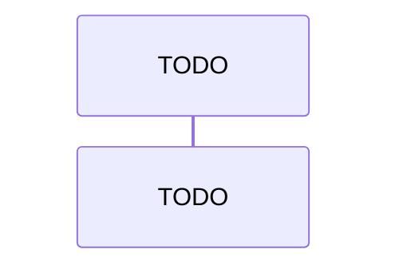

## Purpose

This skill is the operating manual the `project-overview` runtime agent reloads at the start of every run. It is the auditable source for narrative-tree generation under `docs/narrative/` — BC detection cited by reference to `project-explorer`, narrative file content contracts (`architecture.md` + `walkthrough.md`), Mermaid sourcing rules, frontmatter contract, human-edit fence convention, APPROVE gate, idempotency guard. The agent treats this file as authoritative for the run; the co-located `research.md` carries the long-form citations and per-category enumerations that this file cites by reference.

## Inputs

- `<path>` (required) — local filesystem path to the target repository. No remote URLs; no cloning; no git invocation. The agent reads the path read-only.
- `[branch-name]` (optional) — recording-only string. Written to the `branch_name` field in each generated file's frontmatter. The user is responsible for actually checking out the branch they want recorded before invoking the command — the agent does not switch branches.

## Idempotency guard

Before reloading this skill (operating procedure step 2), the agent checks `docs/narrative/` of the **current working directory** (not `<path>`).

**Refuse condition.** `docs/narrative/` exists AND contains at least one non-hidden file when searched recursively. "Hidden" means the filename starts with `.` — the POSIX convention; the Windows filesystem hidden attribute is not consulted. Examples of hidden files that do NOT trigger refusal: `.git`, `.DS_Store`, `.gitkeep`.

**Proceed condition.** `docs/narrative/` is missing, OR `docs/narrative/` exists but contains no non-hidden files (recursive). Empty subtrees alone do not trigger refusal — only at least one non-hidden file (recursive) triggers.

**Refusal message.** When the refuse condition is met, the agent prints the literal message:

```
docs/narrative/ is not empty. project-overview is a one-shot bootstrapper. Re-run after manually clearing docs/narrative/ if you need to regenerate.
```

and exits before the skill-load step (step 2 of `## Operating procedure`) continues. No repo walk, no candidate surfacing, no writes.

## Operating procedure

Numbered steps 1-7. The agent must execute these in order; later sections in this skill fill in the precise contract for each step.

1. **Idempotency guard.** Resolve `<path>`; check the current working directory's `docs/narrative/`. If it exists and is non-empty, refuse with the canonical message and exit before any further step runs. See `## Idempotency guard` above.
2. **Skill load.** The agent reloads this `SKILL.md` and treats it as the operating manual for the rest of the run. The agent must not proceed past this step if the skill file is missing or malformed.
3. **Repo walk.** The agent scans `<path>` for exposed endpoints, handlers, workers, and domain code signals via the reuse-by-reference rule in `## BC candidate surfacing (cite project-explorer)` below. Excludes test projects, generated files, `bin/`, `obj/`, `node_modules/`, `dist/` per the same exclusion globs as `project-explorer`.
4. **BC candidate surfacing.** The agent groups signals into bounded-context candidates per `## BC candidate surfacing (cite project-explorer)` below — same grouping rule as the sibling skill.
5. **Human-in-the-loop APPROVE gate.** The agent prints the candidate report and halts on the literal `APPROVE` token per `## APPROVE gate` below. No file is written under `docs/narrative/` until the user types the literal token `APPROVE`.
6. **Output generation.** Once APPROVE is received, the agent writes `docs/narrative/architecture.md` and `docs/narrative/<bc>/walkthrough.md` per `## Output schema` below.
7. **Frontmatter recording.** Every file the agent emits under `docs/narrative/` carries the five-field YAML frontmatter block per `## Frontmatter contract` below.

## BC candidate surfacing (cite project-explorer)

This section is the full contract for steps 4 and 5 of the `## Operating procedure`. The contract is **reused by reference, not by copy** from the sibling skill — the runtime agent loads the sibling's authoritative content at runtime.

- **Grouping rule reuse.** BC grouping rules are reused verbatim from `.claude/skills/project-explorer/SKILL.md` `## BC candidate surfacing` `### Grouping rule`. Reference by section name; the text is not duplicated here. The rule: BC candidates MUST be derived from observable repo namespacing, top-level project boundaries, or folder structure observed during step 3 (repo walk); each candidate name MUST trace to a real namespace token or folder path; names that do not trace to source MUST be rejected before the candidate report is printed.

- **Candidate report format reuse.** The candidate report format is reused verbatim from `.claude/skills/project-explorer/SKILL.md` `## BC candidate surfacing` `### Candidate report format` — same numbered `### BC candidates` list with per-candidate nested bullets (`Rationale` naming the contributing folders / namespaces, `Aggregates detected` listing the aggregate root with `file:line` citation as an inline-code span), same `### Conflicts detected` H3 subsection (rendered as `(none)` when empty).

- **Small-repo fallback detection reuse.** Small-repo fallback detection rules are reused verbatim from `.claude/skills/project-explorer/SKILL.md` `## BC candidate surfacing` `### Small-repo fallback detection`. The same three independent triggers apply (total first-class source files < 20; only one top-level namespace or project; BC candidate count <= 1). When the fallback fires, the agent emits a single-folder narrative tree at `docs/narrative/module-map/walkthrough.md` (mirroring `module-map` as a fallback-mode token, exempt from the trace-to-source rule, same as the sibling skill).

The reuse is by reference, not by copy. Any edit to grouping rules, candidate report format, or fallback detection in `.claude/skills/project-explorer/SKILL.md` is automatically inherited by this skill on next reload.

## Output schema

The agent emits a human-readable narrative tree under `docs/narrative/` of the working directory. The three subsections below define exactly which files are written, what content each file carries, and the always-emit `## Stubs` summary contract per `analyze-workflow-project-explore.analyzed.md` § 7 row 5. Frontmatter contract for every emitted file is defined in `## Frontmatter contract`; every file under `docs/narrative/` carries the five-field YAML block as its first content.

### Files written

```
docs/
  narrative/                                # OUTPUT TARGET (written at runtime, not at scaffold-author time)
    architecture.md
    <bounded-context>/
      walkthrough.md
```

### Per-file content contract

All `file:line` citations in the output tree use paths relative to the `<path>` root the agent was invoked against. Empty sections are rendered as `(none)` rather than omitted, preserving the locked file shape for the deferred narrative diff updater (F1).

| File | Required content |
|---|---|
| `architecture.md` | One-pager narrative overview. Section list in order: `## Overview` (3-paragraph plain-words intro to the repo and its business purpose), `## File structure` (annotated tree of the top-level repo layout — directories + one-line descriptions), `## Dependencies` (bulleted list of top-level external dependencies — frameworks, runtimes, datastores — derived from `*.csproj` / `package.json` / `pom.xml` / equivalent), `## Exposed endpoints` (table of detected HTTP / gRPC / message-queue entry points with `file:line` citation column), `## Workers` (table of detected background workers / hosted services / scheduled jobs with `file:line` citation column), `## Logic overview` (one paragraph per detected BC summarising its responsibility in plain words). `(none)` for empty sections. All `file:line` citations relative to `<path>`. |
| `<bounded-context>/walkthrough.md` | Per-BC narrative walkthrough. Section list in order: `## Sequence diagram` (exactly one Mermaid sequence diagram of the BC's main flow — see `## Mermaid sourcing rules` for derived-vs-stub policy), `## Intro` (3-paragraph plain-words intro to what this BC does, who its actors are, and what its key invariants are), one `## Drill-down: <name>` section per detected endpoint / handler / worker inside the BC (each contains a 1-2 paragraph technical explanation with `file:line` citations as inline-code spans). `(none)` for empty sections. Single file per BC — no fan-out. |

### Stubs summary contract

Every `walkthrough.md` file carries a `## Stubs` H2 section near the top of the file (immediately after the frontmatter and before the first content section) summarising every `TODO: ` stub block elsewhere in the file. The section renders as `(none)` when no stubs were emitted. See `## Mermaid sourcing rules` below for the per-stub format. The `## Stubs` section is **always emitted on every `walkthrough.md`** — its body is `(none)` when no stubs were emitted, but the heading is always present. The `## Stubs` section is **not emitted in `architecture.md`** (no Mermaid blocks appear there). This is the contract called out in `analyze-workflow-project-explore.analyzed.md` § 7 row 5.

## Frontmatter contract

Every file the agent emits under `docs/narrative/` carries a five-field YAML frontmatter block as its **first content**, before any heading. The contract:

- **`source_repo`** — the `<path>` argument resolved to an absolute path, normalized to POSIX-style forward slashes (the agent normalizes Windows backslashes to forward slashes). Trailing slashes are stripped. UNC paths and symlinks are passed through as the OS resolves them; this contract does not enforce a specific transformation beyond slash normalization.
- **`branch_name`** — the `[branch-name]` argument as a YAML scalar when supplied (e.g., `branch_name: main`). When the argument is omitted, the value is the bare YAML `null` token (which parses as the YAML null value), NOT the quoted string `"null"`.
- **`generated_at`** — ISO-8601 UTC timestamp with second precision and the literal `Z` suffix, e.g., `2026-05-18T10:30:00Z`. Sub-second precision is not used. The timezone is always UTC.
- **`skill_version`** — integer matching the `version` field of this `SKILL.md`'s YAML frontmatter (currently `1`). If a future revision of this skill bumps the `version` field, the writer stamps the new integer; the contract has no auto-track magic.
- **`last_generated_sha`** — added for parity with the field `project-wiki-enhancer` introduces on `docs/domain/`. v1 emits this field on every file under `docs/narrative/` when `<path>` is a git working tree, stamped to current HEAD SHA at the time of the run. When `<path>` is not a git working tree, the field is **omitted entirely** from the frontmatter block (same tolerate-missing convention as `project-wiki-enhancer`'s no-git path — see `.claude/skills/project-wiki-enhancer/SKILL.md` `## Hybrid diff strategy` `### last_generated_sha tolerate-missing`).

Example frontmatter block emitted at the top of every file under `docs/narrative/` (git working tree case):

```yaml
---
source_repo: C:/repos/eShopOnContainers
branch_name: main
generated_at: 2026-05-18T10:30:00Z
skill_version: 1
last_generated_sha: 4f3a2b1c9d8e7f6a5b4c3d2e1f0a9b8c7d6e5f4a
---
```

The frontmatter block is the **first content** in every file under `docs/narrative/`, before any heading or paragraph. If a heading appears before the frontmatter block, the file is malformed.

## Human-edit fences

Every file the agent emits under `docs/narrative/` carries `<!-- human:begin -->` and `<!-- human:end -->` fence markers around editable zones, exactly mirroring `docs/domain/`'s convention.

**Canonical fence placement.**

- In `walkthrough.md`: one fence pair immediately after each `## Intro` H2 heading. The fenced zone is the space where a human reader records additional plain-language context, corrections, or domain-expert commentary that should survive future regenerations.
- In `architecture.md`: one fence pair immediately after the `## Overview` H2 heading. The fenced zone is the space where a human reader records repo-level commentary (e.g., business context, historical decisions) that should survive future regenerations.

Any future diff-aware narrative updater (deferred F1) preserves the fenced content byte-for-byte per `.claude/skills/project-wiki-enhancer/SKILL.md` `### Fenced human-edit zone splice`'s rule. v1 narrative is one-shot bootstrap and therefore the fences are inert until F1 lands — they are emitted as scaffolding so the first human reviewer can drop edits inside them immediately.

## Mermaid sourcing rules

**Derived-where-reliable rule.** A Mermaid sequence diagram MAY be derived from code only when every node in the sequence cites a real `file:line` location in `<path>`. Nodes without a traceable `file:line` MUST NOT appear in a derived diagram.

**Stub-otherwise rule.** When the agent cannot reliably derive every node, it emits a `TODO: ` stub block instead. The stub format is a Mermaid code fence whose first line inside the fence is the literal `sequenceDiagram` keyword (required so Mermaid renderers parse the block), followed by the literal comment `%% TODO: derive this sequence — agent could not trace <N> step(s) to file:line` (where `<N>` is the count of underivable steps), followed by a single placeholder participant line. Example block:

````

````

**No-hallucination guard.** The agent MUST NOT invent participant names, message arrows, or `file:line` citations. This stance mirrors `.claude/skills/project-explorer/SKILL.md` `### Hallucination guard` for narrative output.

**Top-of-file `## Stubs` summary requirement.** Every `walkthrough.md` file MUST carry a `## Stubs` H2 section immediately after the frontmatter and before the first content section. The section lists every stub in the file as a bulleted line `- <section name>: <reason>` (e.g., `- Drill-down: PlaceOrderEndpoint: could not trace 4 step(s) to file:line`). Files with zero stubs render `## Stubs` with body `(none)` — the section is **always present** on every `walkthrough.md`, even when empty. The `## Stubs` section is **not emitted in `architecture.md`** (no Mermaid blocks appear there). This is the operator-visible flag referenced in `analyze-workflow-project-explore.analyzed.md` § 7 row 5.

## APPROVE gate

This contract is reused by reference from `.claude/skills/project-explorer/SKILL.md` `### APPROVE gate contract` — only the literal prompt target is substituted. The cite-by-reference keeps the gate contract in a single place; any future edit to the sibling skill's gate contract is inherited here on next reload.

After printing the candidate report, the agent halts and prints the literal prompt:

```
Type APPROVE to write docs/narrative/, or describe edits.
```

The agent MUST NOT write any file under `docs/narrative/` until the user's response, after trimming leading and trailing whitespace (trim is exact-case-preserving), matches the literal token `APPROVE` exact-case. Case variants (`approve`, `Approve`, `approve!`), yes-equivalents (`ok`, `yes`, `sure`), and any other text are treated as edit instructions per the loop below — never as approval.

**Edit-revision loop.** Any response that is not the literal exact-case `APPROVE` is treated as a free-text edit instruction. The agent interprets it (typical edits: rename a BC, merge two BCs, split one BC into two, flip the fallback flag, drop or add a candidate). The agent then regenerates the candidate report with the change applied, prefixed by an `Applied edits:` preamble that summarises what changed, then re-prints the literal APPROVE prompt. If the response has no actionable change (e.g., the user typed `approve` lowercase), the preamble is `Applied edits: (no actionable change interpreted from your response; if you intended approval, please type the literal token APPROVE in exact case.)`. After the preamble + revised report, the agent re-prints the literal APPROVE prompt. The loop has **no round cap** — it iterates until the user types exact-case `APPROVE` or aborts the session.

## Stop conditions

- **(a) Idempotency guard refuses.** `docs/narrative/` already exists and is non-empty in the working directory. The agent exits before any further step per `## Idempotency guard`.
- **(b) APPROVE gate not satisfied.** User does not type the literal exact-case `APPROVE` token at the BC gate; any other response is treated as an edit per `## APPROVE gate` — never as approval.
- **(c) Skill file missing or malformed.** `.claude/skills/project-overview/SKILL.md` cannot be read, its YAML frontmatter does not parse, or required body sections (`## Operating procedure`, `## BC candidate surfacing (cite project-explorer)`, `## Output schema`, `## Frontmatter contract`, `## APPROVE gate`) are absent. The agent stops before step 3 of `## Operating procedure`.
- **(d) Sibling skill missing or malformed.** `.claude/skills/project-explorer/SKILL.md` cannot be read or its required sections (`### Grouping rule`, `### Candidate report format`, `### Small-repo fallback detection`, `### APPROVE gate contract`) are absent. The agent stops before step 3 of `## Operating procedure` — BC surfacing cannot proceed without the sibling's grouping rule. (Without this guard, the cite-by-reference rule in `## BC candidate surfacing (cite project-explorer)` would silently degrade.)
