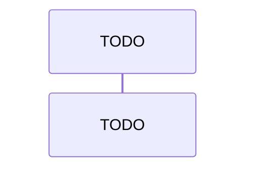

## Purpose

The operating manual the `project-overview` agent reloads at the start of every run and treats as authoritative: BC detection (stated in full here, not inherited), the `architecture.md` + `walkthrough.md` content contracts, Mermaid sourcing rules, frontmatter contract, fence convention, auto-write contract, idempotency guard. The co-located `research.md` carries long-form citations this file cites by reference.

The `project-update` agent also reloads this file for the narrative pass of `/project:update`. The bootstrap agent uses sections above `## Diff-aware update mode`; the enhancer uses those at or below it **plus** `./references/diff-update.md`, which holds the update-pass contracts in full. They live there so the bootstrap agent stops carrying them in its preamble on every request.

## Inputs

- `<path>` (required) — local filesystem path to the target repo. No remote URLs, no cloning, no git invocation; read-only.
- `[branch-name]` (optional) — recording-only, written to `branch_name` in each file's frontmatter. The user checks out the branch themselves; the agent never switches branches.

## Scan scope (repo-layout manifest)

Before the repo walk, resolve scan scope via the `repo-layout` skill — the single source of truth for both the manifest contract and the built-in language whitelist + eight exclusion globs (`## Built-in scan filters`). The sibling `project-explorer` skill resolves scope from the same section, so the two bootstrap passes stay in lockstep without either preloading the other. Walk up from `<path>` to the scan root, read the matching `repos[]` entry:

- **Entry with `roots`** → walk only the declared roots minus effective excludes; each root's `bc` label pins the `<bc>/walkthrough.md` folder name.
- **Entry without `roots`** → whole repo minus effective excludes.
- **No manifest / no entry** → built-in heuristics + the matching advisory from `## Advisory literals`; output byte-identical to pre-manifest runs.

An undeclared source-bearing dir is provisionally scanned and flagged, never silently skipped (`## Precision instrument + discovery safety net`).

## Idempotency guard

Before reloading this skill, check `docs/narrative/` of the **working directory** (not `<path>`).

**Refuse** when `docs/narrative/` exists AND contains at least one non-hidden file, searched recursively. "Hidden" means a leading `.` — the POSIX convention, not the Windows attribute; `.git`, `.DS_Store`, `.gitkeep` do not trigger refusal. **Proceed** when the folder is missing, or exists with no non-hidden file; empty subtrees alone never refuse.

On refusal, print the literal message and exit before the skill-load step — no repo walk, no candidate surfacing, no writes:

```
docs/narrative/ is not empty. project-overview is a one-shot bootstrapper. Re-run after manually clearing docs/narrative/ if you need to regenerate.
```

## Output root (nested mode)

Given an `output_root`, write under `<output_root>/docs/narrative/` and run `## Idempotency guard` against that path instead of the bare `docs/narrative/`. The scan `<path>` and every `file:line` citation are unaffected. Absent → bare `docs/narrative/` of the working directory. Set by the orchestrator per the `wiki-orchestration` skill `## Output root (nested mode)`.

## Operating procedure

Steps 1-7, in order. Later sections give the precise contract per step.

1. **Idempotency guard.** Resolve `<path>`; check the working directory's `docs/narrative/`. Non-empty → refuse and exit before anything else runs.
2. **Skill load.** Reload this `SKILL.md` as the operating manual. Do not proceed if it is missing or malformed.
3. **Repo walk.** Resolve scan scope per `## Scan scope (repo-layout manifest)`, then scan in-scope source for exposed endpoints, handlers, workers, and domain code signals. Excludes test projects, generated files, `bin/`, `obj/`, `node_modules/`, `dist/` per the `repo-layout` skill `## Built-in scan filters`, and honours its `## Read discipline` for every file opened.
4. **BC candidate surfacing** per `## BC candidate surfacing`.
5. **Print candidate report (non-blocking)** for the audit trail, then proceed. No approval, no halt.
6. **Output generation.** Write `docs/narrative/architecture.md` and `docs/narrative/<bc>/walkthrough.md` per `## Output schema`.
7. **Frontmatter recording.** Every emitted file carries the five-field YAML block per `## Frontmatter contract`.

## BC candidate surfacing

The full contract for steps 4 and 5, **self-contained**: the narrative agent does not preload the `project-explorer` skill, so everything it needs is here or in the `repo-layout` skill it does preload. The `project-explorer` skill `## BC candidate surfacing` is the canonical wording for the domain pass; the two must stay in lockstep (`## Known coupling`).

- **Grouping rule.** Identical to the `project-explorer` skill `### Grouping rule`. BC candidates MUST derive from observable repo namespacing, top-level project boundaries, or folder structure seen during the walk. Each name MUST trace to a real namespace token or folder path; names that do not trace to source MUST be rejected before the report is printed. When namespace and folder disagree, prefer the namespace as canonical and record the folder in the rationale.
- **Candidate report format.** Identical to the `project-explorer` skill `### Candidate report format` — a numbered `### BC candidates` list with per-candidate nested bullets (`Rationale` naming the contributing folders / namespaces, `Aggregates detected` listing the aggregate root with a `file:line` citation as an inline-code span), a `### Fallback flag` line carrying the boolean plus the triggers that fired, and a `### Conflicts detected` H3 whose entries cite both divergent definitions by `file:line` (`(none)` when empty).
- **Small-repo fallback detection.** Identical to the `project-explorer` skill `### Small-repo fallback detection`. Three independent triggers, any one flips the flag: (i) total first-class source files `< 20`, counted with the whitelist and built-in 8 globs from the `repo-layout` skill `## Built-in scan filters`; (ii) only one top-level namespace or project across the walked set (zero counts as `<= 1`); (iii) BC candidate count `<= 1`. When it fires, emit a single-folder tree at `docs/narrative/module-map/walkthrough.md` — or at `docs/narrative/<bc>/walkthrough.md` when the scanned root carries a manifest `bc` label, which overrides the `module-map` token. `module-map` is a fallback-mode token exempt from the trace-to-source rule.

**Editor obligation.** This section no longer inherits by reload, so an edit to grouping rules, report format, or fallback detection in the `project-explorer` skill must be mirrored here in the same change (`## Known coupling`).

## Comment policy (code is the single source of truth)

Stated in full so the narrative agent needs no sibling skill to apply it: every endpoint, handler, worker, sequence-diagram node, and `file:line` citation written under `docs/narrative/` MUST derive from executable code. Comments, docstrings, and XML-doc are advisory seeds for plain-language prose only (the `## Intro` paragraphs, drill-down descriptions) — they lose every conflict with code, never supply or alter a `file:line` citation, and never decide a BC boundary. This composes with `## Mermaid sourcing rules`' no-hallucination guard: a node justifiable only from a comment is not derivable and falls to the `TODO: ` stub path. Same policy as the `project-explorer` skill's section of the same name; edit both together (`## Known coupling`).

## Output schema

All `file:line` citations use paths relative to the `<path>` root. Empty sections render as `(none)` rather than being omitted, preserving the locked file shape the narrative updater consumes.

### Files written

```
docs/
  narrative/                                # OUTPUT TARGET (written at runtime, not at scaffold-author time)
    architecture.md
    <bounded-context>/
      walkthrough.md
```

### Per-file content contract

| File | Required content |
|---|---|
| `architecture.md` | One-pager narrative overview, sections in order: `## Overview` (3-paragraph plain-words intro to the repo and its business purpose), `## File structure` (annotated tree of the top-level layout — directories + one-line descriptions), `## Dependencies` (top-level external dependencies — frameworks, runtimes, datastores — from `*.csproj` / `package.json` / `pom.xml` / equivalent), `## Exposed endpoints` (HTTP / gRPC / message-queue entry points, with a `file:line` column), `## Workers` (background workers / hosted services / scheduled jobs, with a `file:line` column), `## Outbound dependencies`, `## Stores owned`, `## Config-swapped seams`, `## Out-of-scope mediators` (the four tables in `### Integration inventory contract`), `## Logic overview` (one paragraph per detected BC, plain words), `## Skipped candidates` (removed-BC log target; `(none)` when bootstrap detected no skips). |
| `<bounded-context>/walkthrough.md` | Per-BC walkthrough, sections in order: `## Sequence diagram` (exactly one Mermaid sequence diagram of the BC's main flow — see `## Mermaid sourcing rules`), `## Intro` (3 plain-words paragraphs: what this BC does, who its actors are, what its key invariants are), then one `## Drill-down: <name>` per detected endpoint / handler / worker, each 1-2 paragraphs with `file:line` citations as inline-code spans. Single file per BC — no fan-out. |

### Integration inventory contract

Four tables, always emitted, `(none)` when empty. A **rollup** above this repo has to draw the system and, under leaf-scope confinement, can see only what these tables say. Prose in `## Logic overview` cannot be joined on; these can. `## Dependencies` is not one of them and does not replace them — that section lists packages the build pulls in; these list **runtime edges** the process actually reaches, and the configuration deciding where.

**1. `## Outbound dependencies`** — every call that leaves this process.

```
| Target | Client or interface | Route or protocol | Config key | Cited at |
|---|---|---|---|---|
| a sibling service | `IAgentClient` / `HttpAgentClient` | `POST /api/agent/chat` | `Agent:BaseUrl` | `Shared/DependencyInjection.cs:55` |
```

`Config key` is **mandatory**, written exactly as code reads it. Hard-coded target → `none — hard-coded`. Vendor SDK owning the address with only a credential configured → name the credential key and add `(SDK default endpoint)`. **Never leave the cell vague** — a rollup given "with a database URL" instead of a key name cannot label the edge. Name the target as concretely as the code allows; when the code genuinely does not name it, say so in `Target` rather than guessing. Include datastores, caches, brokers, model hosts, telemetry collectors, and identity providers.

**2. `## Stores owned`** — persistent state this repo, and only this repo, connects to.

```
| Store | Engine | Objects | Config key | Cited at |
|---|---|---|---|---|
| the conversation record | PostgreSQL | tables `conversation`, `message` | `ConnectionStrings:PostgresDb` | `Shared/DependencyInjection.cs:29` |
```

Name the actual tables, views, collections, or indexes. `Objects` is what makes two rows for one engine legibly different, and a rollup uses it to decide whether two repos share an instance or merely share a product.

**3. `## Config-swapped seams`** — the highest-value table here, and the one no other section captures.

```
| Config key | With it set | With it absent | Cited at |
|---|---|---|---|
| `Authz:BaseUrl` | `AuthzClient` — real HTTP call | `UnconfiguredAuthzClient` — throws `authz.notConfigured`, no call leaves the process | `Infrastructure/Identity/IdentityRegistration.cs:19` |
```

One row per **config branch**: any key whose presence or absence changes what the process does at startup. Name both implementations as written — `Unconfigured*`, `Stub*`, `Fake*`, `Mock*`, an in-memory store, a hermetic double.

A key that fails fast is a row, not an omission. Two shapes, and the table must tell them apart:

| Shape | `With it absent` cell begins | Means |
|---|---|---|
| swap | the stand-in's name | the process starts and answers, without leaving itself |
| fail-fast | the literal words `fail-fast —` | the process refuses to start at all |

Write `(none)` only when the repo has **no** config branch of either shape. A repo whose every key throws on absence has a table full of `fail-fast —` rows, and that is the most informative thing it can say about itself.

**4. `## Out-of-scope mediators`** — outbound calls made through code you could not read.

```
| Library | What it mediates | Why out of scope |
|---|---|---|
| `AskNanci.ServiceDefaults` | OpenTelemetry export, health endpoints | declared but not a scanned root |
```

A shared library referenced here whose own source sits outside the scan scope and that mediates a real outbound call. **Record the gap; do not follow it** — following it would break leaf-scope confinement. Without this table the edge vanishes: five hosts can each reach a collector through one shared library and no repo's narrative mentions a collector at all.

### Stubs summary contract

Every `walkthrough.md` carries a `## Stubs` H2 immediately after the frontmatter and before the first content section, summarising every `TODO: ` stub block elsewhere in the file (per-stub format in `## Mermaid sourcing rules`). The heading is **always emitted**; its body is `(none)` when there are no stubs. It is **not** emitted in `architecture.md`, which carries no Mermaid blocks.

## Frontmatter contract

Every file under `docs/narrative/` carries a five-field YAML block as its **first content**, before any heading. A heading before the block means the file is malformed.

- **`source_repo`** — `<path>` resolved to an absolute path, normalized to POSIX forward slashes, trailing slashes stripped. UNC paths and symlinks pass through as the OS resolves them.
- **`branch_name`** — the `[branch-name]` argument as a YAML scalar (e.g. `branch_name: main`), or the bare YAML `null` token when omitted — never the quoted string `"null"`.
- **`generated_at`** — ISO-8601 UTC, second precision, literal `Z` suffix, e.g. `2026-05-18T10:30:00Z`. No sub-second precision; always UTC.
- **`skill_version`** — integer matching this file's frontmatter `version` (currently `2`). A future bump is stamped by the writer; there is no auto-track magic.
- **`last_generated_sha`** — parity with the field `project-update` introduces on `docs/domain/`. Emitted on every file when `<path>` is a git working tree, stamped to current HEAD at run time; **omitted entirely** when it is not (same tolerate-missing convention as the `project-update` skill `### last_generated_sha tolerate-missing`).

```yaml
---
source_repo: C:/repos/eShopOnContainers
branch_name: main
generated_at: 2026-05-18T10:30:00Z
skill_version: 2
last_generated_sha: 4f3a2b1c9d8e7f6a5b4c3d2e1f0a9b8c7d6e5f4a
---
```

## Human-edit fences

Every emitted file carries `<!-- human:begin -->` / `<!-- human:end -->` markers around editable zones, mirroring `docs/domain/`'s convention. Canonical placement: in `walkthrough.md`, one pair immediately after each `## Intro` H2; in `architecture.md`, one pair immediately after the `## Overview` H2. Those zones are where a human records context, corrections, or domain-expert commentary that must survive regeneration.

The narrative updater preserves fenced content byte-for-byte per `## Fenced human-edit zone splice (narrative)` — the fences are not inert.

**Migration shift, identical to the domain side.** With `## Per-BC SHA pre-check (narrative)` in place, regen never fires for a BC whose narrative source slice is unchanged, so an outside-fence edit survives until that slice changes — then regen fires and overwrites it exactly as before. Fences remain the **only** way to make an edit durable **across a source change**; an outside-fence edit gets a reprieve, not durability. Canonical statement: the `project-update` skill `## Migration caveat`.

## Diff-aware update mode

Entry point for the narrative pass of `/project:update`. This section and the seven below are consumed **only** by the `project-update` agent; their full contracts live in `./references/diff-update.md` under these same headings, and that agent reads the file at the point of use. The `project-overview` bootstrap agent never enters update mode and never reads it. Headings are kept here verbatim so existing citations of the form "the `project-overview` skill `## <heading>`" still resolve.

## Hybrid diff strategy (narrative)

Git fast path / full-walk fallback / reason-token short-circuit / `last_generated_sha` tolerate-missing, and which narrative file is sampled. Full contract: `./references/diff-update.md` `## Hybrid diff strategy (narrative)`.

## Path -> BC classifier (narrative)

The three classification buckets (`BC-affecting` / `infra — no BC impact` / `new-namespace`) and the eight exclusion globs the narrative pass reuses unmodified. Full contract: `./references/diff-update.md` `## Path -> BC classifier (narrative)`.

## Per-BC SHA pre-check (narrative)

Narrative source-slice resolution, conservative any-missing / any-unreachable / unresolvable no-skip gates, oldest-wins `min(reachable)` base, empty -> SKIP / non-empty -> fall-through. Identical algorithm to the domain side, different inputs. Full contract: `./references/diff-update.md` `## Per-BC SHA pre-check (narrative)`.

## Fenced human-edit zone splice (narrative)

Byte-for-byte preservation of `<!-- human:begin -->` / `<!-- human:end -->` zones on the narrative side, for both canonical placements defined in `## Human-edit fences` above. Full contract: `./references/diff-update.md` `## Fenced human-edit zone splice (narrative)`.

## Removed-BC logging (narrative)

Append-only log of BC folders whose namespace is no longer present in source. Never delete a `walkthrough.md`, never delete the `<bc>/` folder, never touch anything inside it beyond the single `architecture.md` append. Full contract: `./references/diff-update.md` `## Removed-BC logging (narrative)`.

## Byte-compare + selective write + frontmatter refresh (narrative)

Write only files whose bytes actually changed, and refresh frontmatter accordingly. Full contract: `./references/diff-update.md` `## Byte-compare + selective write + frontmatter refresh (narrative)`.

## Idempotency exit (narrative)

The once-per-run, cross-pass `No changes detected. 0 files written.` exit. Full contract: `./references/diff-update.md` `## Idempotency exit (narrative)`.

## Known coupling

- **Soft-input cite-back.** The `project-explorer` skill documents the soft-input read of `docs/narrative/<bc>/walkthrough.md`; that contract is fully active.
- **Mirrored, no longer inherited.** The `project-overview` agent does **not** preload the `project-explorer` skill — carrying a 27k-character sibling in the preamble of every request of every bootstrap run was the single largest avoidable cost in the pipeline. `## BC candidate surfacing` and `## Comment policy (code is the single source of truth)` are therefore stated in full here. An edit to either contract in the sibling MUST be mirrored here in the same change, and vice versa. The `project-update` agent preloads both, so it sees drift first.
- **Shared filters.** The language whitelist, the built-in 8 globs, and the never-read list are owned by the `repo-layout` skill (`## Built-in scan filters`, `## Read discipline`) — the one skill all three crew agents preload. Neither bootstrap skill restates them.
- **Update contracts are read on demand.** `## Diff-aware update mode` and the seven sections under it forward to `./references/diff-update.md`, which only the enhancer reads.

## Mermaid sourcing rules

**Derived where reliable.** A Mermaid sequence diagram MAY be derived from code only when every node cites a real `file:line` in `<path>`. Nodes without a traceable `file:line` MUST NOT appear in a derived diagram.

**Stub otherwise.** When the agent cannot reliably derive every node it emits a `TODO: ` stub instead: a Mermaid fence whose first line inside is the literal `sequenceDiagram` keyword (required for renderers to parse it), then the literal comment `%% TODO: derive this sequence — agent could not trace <N> step(s) to file:line` with `<N>` the count of underivable steps, then one placeholder participant line:

````

````

**No-hallucination guard.** Never invent participant names, message arrows, or `file:line` citations. Mirrors the `project-explorer` skill `### Hallucination guard`.

**`## Stubs` summary.** Every `walkthrough.md` MUST carry the `## Stubs` H2 per `## Output schema` `### Stubs summary contract`, listing each stub as `- <section name>: <reason>` (e.g. `- Drill-down: PlaceOrderEndpoint: could not trace 4 step(s) to file:line`). It is the operator-visible flag for stubs.

## Auto-write

Identical posture to the `project-explorer` skill `### Auto-write contract`, applied to `docs/narrative/`. The agent is **fully agent-driven**: after printing the candidate report (`## BC candidate surfacing`) it writes immediately. No APPROVE gate, no halt, no edit-revision loop. The only thing that stops a run is `## Idempotency guard` — a re-run safety check, not an approval gate.

## Stop conditions

- **(a) Idempotency guard refuses.** `docs/narrative/` exists and is non-empty in the working directory; exit before any further step.
- **(b) Skill file missing or malformed.** This skill cannot be read, its YAML frontmatter does not parse, or a required body section (`## Operating procedure`, `## BC candidate surfacing`, `## Output schema`, `## Frontmatter contract`, `## Auto-write`) is absent. Stop before step 3.
- **(c) Scan-scope skill missing or malformed.** The `repo-layout` skill cannot be read, or its `## Built-in scan filters` / `## Read discipline` sections are absent. Stop before step 3 — the agent cannot decide what counts as first-class source, nor how much of a file to open, without them. This replaces the former sibling-skill guard: BC surfacing no longer depends on the `project-explorer` skill being loadable.
