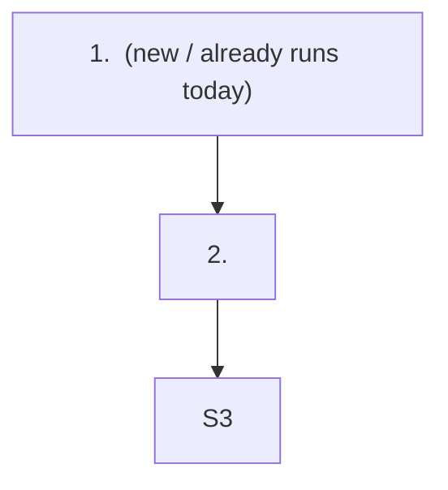

# <Feature title> — Overview plan

> Status: [Waiting for Approval]

## 1. Purpose

<One paragraph. The user-facing outcome. Not the implementation.>

## 2. What is exposed

<Outside view only: what a caller or a user sees. One `### <Kind> — <short description>` sub-section
per kind of exposure. Nothing exposed → one line: `None — internal change.`
An internal logic or architecture change is not exposure — its picture goes in §3.>

### API — <short description>

```
API URL: <route>
METHOD: <METHOD>
HEADER: <only when a special value is needed — leave the whole line out otherwise>
QUERY:
  <name>: <type> - <short description>
BODY:
  <name>: <type> - <short description>
RESPONSE:
  <name>: <type> - <short description>
REFUSAL:
  <name>: <type> - <short description>
```

<One block per endpoint, never a table — a table has no room for a field's type and forces prose into
cells. `QUERY` for what rides on the URL, `BODY` for what a write carries; a `GET` has no `BODY`, so
leave that block out. `RESPONSE` and `REFUSAL` are both shapes, not sentences. One field per line,
always `name: type - description`. Nest a field's children by indenting two more spaces.>

### UI — <short description>

- Screen: <where the user is>
- Change: <what is new or different>
- User sees: <the visible result>

<Plain words. ≤5 lines. No pixel detail.>

### Job / CLI / Event — <short description>

- Name: <name>
- Trigger: <when it runs, or what raises it>
- Result: <what it produces, or who reacts>

<Same three lines per item. ≤5 items per kind.>

## 3. Components

### Files this feature touches

```
<repo>/
├─ <dir>/
│  ├─ <file>                                  [added]    <what it gains, a fragment>
│  └─ <file>                                  [edited]   <what changes, a fragment>
└─ <dir>/<file>                               [deleted]  <why it goes>
```

<The tree is the **only** file list in this document — never repeat it as prose underneath. Every
leaf carries its tag and one note. **The whole line — indent, box characters, filename, tag, and note
— fits in 100 characters.** Pad the filename column so the tags line up, then the note takes what is
left. Notes are fragments, not sentences: `+1 MapGet on the /api/users group`, not `one MapGet added
under the existing /api/users group, wired the same way as the others`. A wrapped line pushes the box
characters out of column and the tree stops being a tree — shorten the note, never the tree.

**Before writing the tree, search for tests that pin a global invariant this feature will break** —
route-surface tests, DI-registration tests, contract or snapshot tests, architecture-fitness tests.
They are not files the feature "touches" in the forward sense, but every one of them fails the moment
it lands. A missed one becomes a build failure nobody owns. List them like any other leaf.>

| Component | New or changed | Job (one line) |
|---|---|---|
| <name> | new / changed | <what it does after this feature> |

<"changed" rows start from the requirement's `## Current behavior`. No before/after prose here and no
structure diagram — the delta belongs inside the flow in §4, where a reader sees it in motion.>

## 4. Happy-path flow



| Step | What | External call | Data read | Validation → refusal | New or existing |
|---|---|---|---|---|---|
| 1 | <what the step does> | <the call, and on what — or `none`> | <what is read, in plain words — or `none`> | <what fails here and what it returns — or `none`> | <new step / new step, existing rule / existing, reused unchanged> |

<The diagram is the **workflow**, not the structure: the steps as they will run, each tagged new or
already-running. Mermaid (ASCII fallback), ≤12 nodes, no prose repeating what the nodes say.

The table annotates each step one level deeper. Name the real call — which authorization check,
which query, which service — in **plain words**, never the query text or a method body. One short
line per cell. A step that changes existing behaviour says so in the last column, so the delta is
visible without a second before/after section.>

<Nothing changes in an existing flow and the feature is small → drop the table and keep a plain
numbered list. Do not keep an empty table for its own sake.>

## 5. Key technical decisions

| Concern | Decision |
|---|---|
| <concern> | <the decision — cite `architecture-rules` §n when a rule pins it> |

<Final decisions only, ≤7 rows. No options, no why — those live in `<feature>.overview-plan-trace.md`,
one trace row per row of this table.>

## 6. Steps

| Step | Component(s) | What | Depends on | Covers |
|---|---|---|---|---|
| A | <component> | <one line> | — | SC-1 |
| B | <component> | <one line> | A | SC-2 |
| <last> | E2E gate | Run every case in `<feature>.test.md` | <all> | all |

<This is the **canonical** step list. `analyzed.md`, `plan.md`, `status.md`, and `/feature:implement`
all key on these IDs — do not rename or renumber them afterwards. `Covers` names the `SC-n` the step
serves; a step that covers no SC does not belong here. The final step is always the E2E gate.
Severity, Risks, and Rule overrides are not here — they live in `<feature>.analyzed.md`.>
